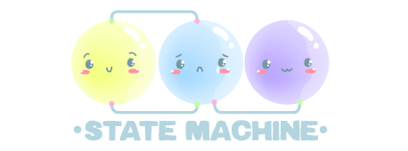

# Object State Machine 1.0.0  

**A hybrid state machine solution for Godot:**  
- **Single node in scene tree** - Add just one `NodeStateMachine` node to your scene
- **No node-based states** - States are pure GDScript objects (not scene nodes)
- **Optimized performance** - Avoids scene tree overhead for state transitions
- **Clean architecture** - Keep your scene tree simple while managing complex behaviors

[](https://ko-fi.com/lowlevel1989)

## How It Works
1. **Add a single node** to your scene (`NodeStateMachine`)
2. **Define states as scripts** (extending `StateAbstract`)
3. **Manage transitions** through lightweight objects
4. **Keep your scene tree clean** - no nested state nodes

## Where to Use This? (Great for Complex Behaviors!)
Create state machines to control:
- **Player behaviors**: Idle, Run, Jump, Attack, Crouch
- **Enemy AI**: Patrol, Chase, Attack, Flee
- **UI Systems**: Main menu, Pause screen, Inventory
- **Game Flow**: Level loading, Cutscenes, Dialogue
- **Complex object states**: Treasure chest (locked, unlocking, open, empty), Security system (armed, disarmed, triggered)
- **Building mechanics**: Placement, Rotation, Connection, Demolition modes

## Installation
1. **Asset Library**: Install directly from Godot Asset Library  
   or  
2. **Manual**:  
   - Download repository
   - Copy `addons/object_state_machine` to your project
   - Enable in Project Settings → Plugins

## Getting Started in 3 Steps

### 1. Add NodeStateMachine to your scene
```gdscript
# player.gd
extends CharacterBody2D

@export var CLASS_STATE_IDLE : Script
@export var CLASS_STATE_WALK : Script
@export var CLASS_STATE_AIR  : Script
@export var CLASS_STATE_JUMP : Script
@export var CLASS_STATE_FALL : Script

var state_idle : StateAbstract
var state_walk : StateAbstract
var state_air  : StateAbstract
var state_jump : StateAbstract
var state_fall : StateAbstract

func _ready():
    state_machine = $NodeStateMachine.get_stage_machine()

    # Create new state machine for movements
    state_machine.create("PlayerSM")

    state_idle = CLASS_STATE_IDLE.new()
    state_walk = CLASS_STATE_WALK.new()
    state_air  = CLASS_STATE_AIR. new()
    state_jump = CLASS_STATE_JUMP.new()
    state_fall = CLASS_STATE_FALL.new()

    # Assign owner and state machine to the state
    state_idle.create(self, state_machine)
    state_walk.create(self, state_machine)
    state_air. create(self, state_machine)
    state_jump.create(self, state_machine)
    state_fall.create(self, state_machine)

    # Assign initial state
    state_machine.set_init_state(state_idle)

func _physics_process(delta : float) -> void:
    state_machine.physics_process(delta)

func free() -> void:
    state_machine.free()
    state_idle.free()
    state_walk.free()
    state_air. free()
    state_jump.free()
    state_fall.free()
```

### 2. Design your state flow
```gdscript
# Add this documentation block at the top of your script
"""
DOC: Player Movement State Machine

States:
- IDLE *
- WALK
- JUMP
- AIR
- FALL

Transitions:
- IDLE  -> WALK  : When moving
- WALK  -> IDLE  : When stopping
- IDLE  -> JUMP  : When jumping
- WALK  -> JUMP  : When jumping
- JUMP  -> AIR   : When ascending
- AIR   -> FALL  : When descending
- FALL  -> IDLE  : When landing
"""
```

### 3. Create state classes
```gdscript
# state_idle.gd (extends StateAbstract, not Node)
extends StateAbstract

var player : CharacterBody2D

func _enter() -> void:
    self.player = self.get_owner()

func _set_name() -> void:
    self._state_name = "Idle"

func _confirm_transition() -> void:
    if not self.player.is_on_floor():
        self.transition_to(self.player.state_air)
        return

    if Input.get_axis("ui_left", "ui_right"):
        self.transition_to(self.player.state_walk)
        return
```

### NodeStateMachine

- To create a state machine add the NodeStateMachine to the desired object as shown in the demo.

### Class StateAbstract, abstract class that allows to define the different states

to define a new state you must create a class from the StateAbstract class and define its behavior.

##### Public methods
- void    StateAbstract::create(owner : Node, state_machine : StateMachine)
- Node    StateAbstract::get_owner()
- void    StateAbstract::transition_to(state : StateAbstract)
- String  StateAbstract::get_name()
- bool    StateAbstract::is_class_state_machine()
- bool    StateAbstract::is_class_state()

##### virtual methods
- void    StateAbstract::_enter()
- void    StateAbstract::_exit()
- void    StateAbstract::_input(event : InputEvent)
- void    StateAbstract::_process(delta : float)
- void    StateAbstract::_physics_process(delta : float)
- void    StateAbstract::_integrate_forces(state : Object)
- void    StateAbstract::_confirm_transition()

##### private methods
- void    StateAbstract::_set_name()

### Class StateMachine
in charge of administering the states.

##### signals
- transitioned(current : StateAbstract, next : StateAbstract)

##### Public methods
- void           StateMachine::create(name : String)
- void           StateMachine::set_init_state(state : StateAbstract)
- void           StateMachine::transition_debug_enable()
- void           StateMachine::transition_debug_disable()
- StateAbstract  StateMachine::get_current_state()
- StateAbstract  StateMachine::get_prev_state()
- void           StateMachine::transition_to(state : StateAbstract)
- void           StateMachine::input(event : InputEvent)
- void           StateMachine::process(delta : float)
- void           StateMachine::physics_process(delta : float)
- void           StateMachine::integrate_forces(state : Object)
- bool           StateMachine::is_class_state_machine()
- bool           StateMachine::is_class_state()

## Thanks
- [nice and good online](https://github.com/niceandgoodonline)
- [Bloomtasy](https://instagram.com/airi_magikal)
